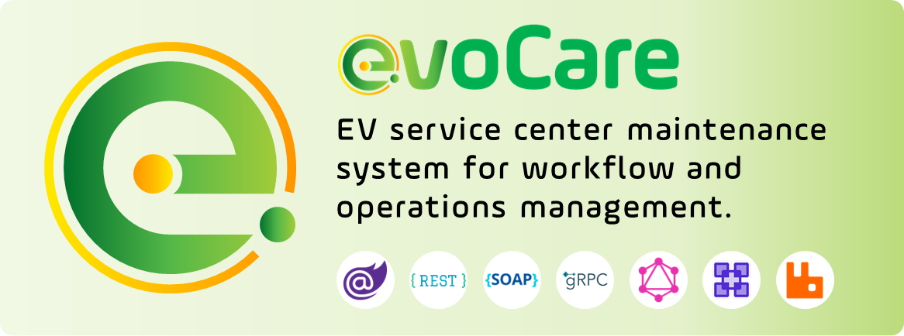

<h1 align="center">
  
</h1>

<!-- 💬🧠 Dynamic Quote Section -->
<h2 align="center">💬 Motivational Vibes 💬</h2>

   

<!-- 🧰💻 Tech Stack Section -->
<h2 align="center"> 🚀 Tech Stack & Tools 🧰</h2>

  
  
  
  

 
 

<!-- 📊🔥 GitHub Stats and Streak Section -->
<h2 align="center">⚡ GitHub Stats ⚡</h2>

  
  

<!-- 🗂️📈 Coding Activities & Most Used Language -->

  

 
 
<!-- 👀 Visitor -->

 
   

---

<!-- 📌📂 Repo Pin -->

    
    
    
    
    
    

